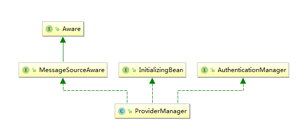
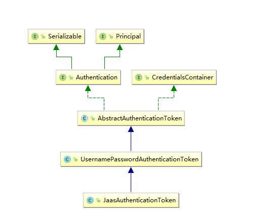
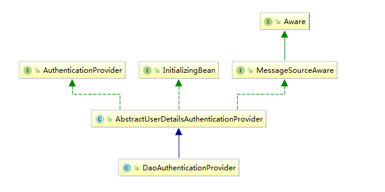
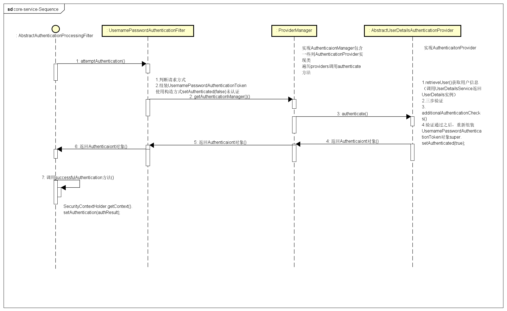

* #### AuthenticationManager 核心验证器
```jshelllanguage
Authentication authenticate(Authentication authentication)
			throws AuthenticationException;
```


* #### ProviderManager 提供了认证的逻辑

> ProviderManager 包含了 List<AuthenticationProvider> 对象
  > AuthenticationProvider  实现类用来支撑对 authentication 对象的验证动作  
    1、 遍历所有的 Providers，然后依次执行该 Provider 的验证方法   
    2、 如果某一个 Provider 验证成功，则跳出循环不再执行后续的验证；
        如果验证成功，会将返回的 result 既 Authentication 对象进一步封装为 Authentication Token；
         比如 UsernamePasswordAuthenticationToken、RememberMeAuthenticationToken 等；这些 Authentication Token 也都继承自 Authentication 对象；  
    3、 如果 #1 没有任何一个 Provider 验证成功，则试图使用其 parent Authentication Manager 进行验证；
    是否需要擦除密码等敏感信息；


*  #### Authentication  认证对象
```jshelllanguage
    //#1.权限结合，可使用AuthorityUtils.commaSeparatedStringToAuthorityList("admin,ROLE_ADMIN")返回字符串权限集合
	Collection<? extends GrantedAuthority> getAuthorities();
    //#2.用户名密码认证时可以理解为密码
	Object getCredentials();
	//#3.认证时包含的一些信息。
	Object getDetails();
	//#4.用户名密码认证时可理解时用户名
	Object getPrincipal();
	//#5.是否被认证，认证为true	
	boolean isAuthenticated();
	//#6.设置是否能被认证
	void setAuthenticated(boolean isAuthenticated) throws IllegalArgumentException;
```


* #### AuthenticationProvider 验证方法

> 核心DaoAuthenticationProvider   
  *  对用户身份进行加密操作；  
    * 可直接返回BCryptPasswordEncoder,也可以自己实现该接口使用自己的加密算法核心方法String encode(CharSequence rawPassword);和boolean matches(CharSequence rawPassword, String encodedPassword);
  * 注入UserDetailsService 获取用户信息,人后调用 additionalAuthenticationChecks() 密码验证

* #### UserDetailsService 获取用户身份信息
  


    


