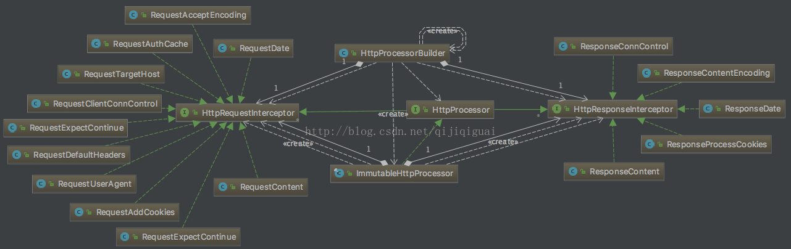

##### HttpContext 执行上下文 (HttpContext可以包含任意对象，因此在多个线程之间共享可能不安全)
 > * **HttpConnection** 表示与目标服务器的实际连接的实例。
 > * **HttpHost** 表示连接目标的实例。
 > * **HttpRoute** 表示完整连接路由的实例
 > * **HttpRequest** 表示实际HTTP请求的实例。执行上下文中的最终HttpRequest对象始终表示消息的状态，与 发送到目标服务器的状态完全相同。默认HTTP / 1.0和HTTP / 1.1使用相对请求URI。但是，如果请求是通过代理以非隧道模式发送的，那么URI将是绝对的。  
 > * **HttpResponse** 表示实际HTTP响应的实例。
 > * **java.lang.Boolean** 表示实际请求是否已完全发送到连接目标的标志的对象。
 > * **RequestConfig** 表示实际请求配置的对象。
 > * **java.util.List<URI>** 表示在请求执行过程中收到的所有重定向位置的集合的对象。
 
##### HttpClientBuilder 解析
 1、 几种类型  
   > Verifier | Planner | Store |  Matcher | Config 是按照特定功能划分的Util型工具类，  
    而且其功能从这几个词的本身含义就能够非常明显的读出来,  
    其中 Strategy 是请求过程中各中处理的应对方法，最终都会汇聚到Exec，再加入到execChain中。   
    而 Processor + HttpRequestInterceptor 则共同组成了对HTTPRequest的处理链条
  > * Handler：处理器，用于执行特定的处理  
  > * Builder, Factory: 生成器，其中Factory倾向于简单的生产，而Builder倾向于很复杂的创建过程
  > * Context：执行环境，本质上是一个Map，用于存储不同信息
  > * Manager: 管理器，让对象执行核心功能，而对象本身则被Manager托管，比如生成、初始化、池化等
  > * Provider：某种对象的提供者
  > * Operator：执行者
  > * Resolver：某种信息的提供者
  > * Registry：本质上是一个Map, 用于注册不同的对象 
  
 ```
private HttpRequestExecutor requestExec; // 创建连接  核心方法 doSendRequest , 由HttpConnection 建立连接： 核心方法 sendRequestHeader （子类: DefaultBHttpClientConnection）
private HostnameVerifier hostnameVerifier; // 用于SSL连接中主机名的校验，因为SSL是要校验证书的
private LayeredConnectionSocketFactory sslSocketFactory; // 创立SSLSocket连接
private SSLContext sslContext; // SSL上下文
private HttpClientConnectionManager connManager; 
//连接管理,负责Connection生成 和 连接释放  (创建Connection由 : ConnectionSocketFactory ：  （PlainConnectionSocketFactory 非https，SSLConnectionSocketFactory https）)
//真正建立连接 是由  HttpClientConnecitonOperator : connect()
private boolean connManagerShared;  //
private SchemePortResolver schemePortResolver; // 不同协议的默认端口，DefaultSchemePortResolver中HTTP是80，HTTPS是443
private ConnectionReuseStrategy reuseStrategy; // 决定一个连接在Request完成之后是否还保持打开
private ConnectionKeepAliveStrategy keepAliveStrategy;  // 返回一个时间，这个时间确定连接保持空闲并打开的最大时间
private AuthenticationStrategy targetAuthStrategy;   // 用于校验是否从服务端返回了权限验证失败的信息，必须是线程安全的
private AuthenticationStrategy proxyAuthStrategy;
private UserTokenHandler userTokenHandler;   // 校验HttpContext是否是一个User专有的，如果是则返回UserToken用于标记唯一的User，不是的话则返回null
private HttpProcessor httpprocessor;  // 一系列处理HTTP协议的拦截器
private DnsResolver dnsResolver;   // 用于重写OS提供的DNS查找功能

private LinkedList<HttpRequestInterceptor> requestFirst;  // HTTP拦截器，用于处理HTTP协议中的特定任务。
private LinkedList<HttpRequestInterceptor> requestLast;
private LinkedList<HttpResponseInterceptor> responseFirst;
private LinkedList<HttpResponseInterceptor> responseLast;

private HttpRequestRetryHandler retryHandler;   // 确定失败重试策略，就如果返回了一个失败或者异常，是否重试。
private HttpRoutePlanner routePlanner; // 从HttpHost, HttpRequest, HttpContext 三个值来获取HttpRoute的过程
private RedirectStrategy redirectStrategy;  // 确认是否需要从当前返回中重定向到其他的地址
private ConnectionBackoffStrategy connectionBackoffStrategy; // 当管理特定Route的多个请求时，从请求结果确认是否是一个BackOff（请求等待）信号。多个请求发生的时候，有时候如果频次太高会造成服务器拒绝，从而需要当出现拒绝信号的时候需要调整后续请求的等待。
private BackoffManager backoffManager; // 从请求的返回中动态调整ConnectionPool大小的控制器，每个Route有一个值，这样就可以限制对特定Host的访问频次了。AIMDBackoffManager中还有一个冷却时间的参数，用于调整一个请求之后多长时间之后才能再次访问。
private ServiceUnavailableRetryStrategy serviceUnavailStrategy;  //当服务不可用的时候，确定是否重试，重试几次
private Lookup<AuthSchemeProvider> authSchemeRegistry;   // AuthSchemeProvider是AuthScheme的工厂，后者定义的是一个针对服务器发出的质疑（也就是权限验证不过）而响应 ？？？？？
private Lookup<CookieSpecProvider> cookieSpecRegistry;  // CookieSpecProvider 是 CookieSpec的工厂，后者定义了Set-Cookie以及Cookie的转换方式
private Map<String, InputStreamFactory> contentDecoderMap;  // 为结果增加Decoding
private CookieStore cookieStore;  //存Cookie的
private CredentialsProvider credentialsProvider;   // 提供验证信息
private String userAgent;
private HttpHost proxy;  //代理
private Collection<? extends Header> defaultHeaders;  /默认的Header
private SocketConfig defaultSocketConfig; // 默认的Socket设置， Timout、保持连接时长、Buffer大小等等
private ConnectionConfig defaultConnectionConfig;  // 默认的Connection设置
private RequestConfig defaultRequestConfig;   // 默认的Request设置
private boolean evictExpiredConnections;  // 是否开启独立线程清理过期连接
private boolean evictIdleConnections;   // 是否开启独立线程清理空闲连接
private long maxIdleTime;  // 最长空闲时间
private TimeUnit maxIdleTimeUnit;   // 最长空闲时间单位

private boolean systemProperties;   // 是否读取系统属性
private boolean redirectHandlingDisabled;  //是否禁用重定向
private boolean automaticRetriesDisabled;  // 是否禁用自动重试
private boolean contentCompressionDisabled;  // 是否禁用内容压缩
private boolean cookieManagementDisabled;  // 是否禁用Cookie管理
private boolean authCachingDisabled;  // 是否禁用缓存
private boolean connectionStateDisabled;   // 是否禁用连接状态

private int maxConnTotal = 0;  // 全局最大维持的连接数
private int maxConnPerRoute = 0;  // 单个Route最大连接数

private long connTimeToLive = -1;
private TimeUnit connTimeToLiveTimeUnit = TimeUnit.MILLISECONDS;

private List<Closeable> closeables;

private PublicSuffixMatcher publicSuffixMatcher;   // 测试域名是否满足公开的域名后缀，比如.com什么的
```