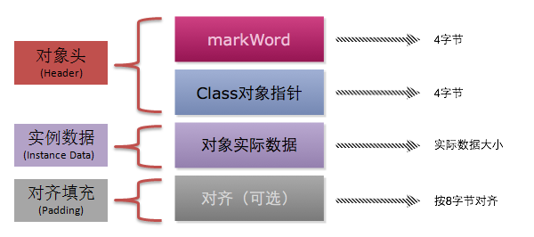

> * Mark Word(标记字段)：对象的Mark Word部分占4个字节，其内容是一系列的标记位，比如轻量级锁的标记位，偏向锁标记位等等。
> * Klass Pointer（Class对象指针）：Class对象指针的大小也是4个字节，其指向的位置是对象对应的Class对象（其对应的元数据对象）的内存地址
> * 对象实际数据：这里面包括了对象的所有成员变量，其大小由各个成员变量的大小决定，比如：byte和boolean是1个字节，short和char是2个字节，int和float是4个字节，long和double是8个字节，reference是4个字节
> * 对齐：最后一部分是对齐填充的字节，按8个字节填充。


##### Mark Word +  (Class对象指针)  对象头结构 
```java
// Bit-format of an object header (most significant first, big endian layout below):
//
//  32 bits:
//  --------
//             hash:25 ------------>| age:4    biased_lock:1 lock:2 (normal object)
//             JavaThread*:23 epoch:2 age:4    biased_lock:1 lock:2 (biased object)
//             size:32 ------------------------------------------>| (CMS free block)
//             PromotedObject*:29 ---------->| promo_bits:3 ----->| (CMS promoted object)
//
//  64 bits:
//  --------
//  unused:25 hash:31 -->| unused:1   age:4    biased_lock:1 lock:2 (normal object)
//  JavaThread*:54 epoch:2 unused:1   age:4    biased_lock:1 lock:2 (biased object)
//  PromotedObject*:61 --------------------->| promo_bits:3 ----->| (CMS promoted object)
//  size:64 ----------------------------------------------------->| (CMS free block)
//
//  unused:25 hash:31 -->| cms_free:1 age:4    biased_lock:1 lock:2 (COOPs && normal object)
//  JavaThread*:54 epoch:2 cms_free:1 age:4    biased_lock:1 lock:2 (COOPs && biased object)
//  narrowOop:32 unused:24 cms_free:1 unused:4 promo_bits:3 ----->| (COOPs && CMS promoted object)
//  unused:21 size:35 -->| cms_free:1 unused:7 ------------------>| (COOPs && CMS free block)
```

>* hash：保存对象的哈希码  
> * age： 保存对象的分代年龄  
> * biased_lock： 偏向锁标识位  
> * lock： 锁状态标识位
> * JavaThread*： 保存持有偏向锁的线程ID
> * epoch： 保存偏向时间戳


> **32位存储如下**


|存储内容|	标志位|	状态|
|: ------ :|: ------ :|: ------ :|
|对象哈希码、对象分代年龄|	01|	未锁定|
|指向锁记录的指针|	00	|轻量级锁定|
|指向重量级锁的指针|	10|	膨胀（重量级锁定）|
|空，不需要记录信息|	11|	GC标记|
|偏向线程ID、偏向时间戳、对象分代年龄|	01|	可偏向|
> **64位存储如下**


[四种锁详解](../thread/someLock.md)


