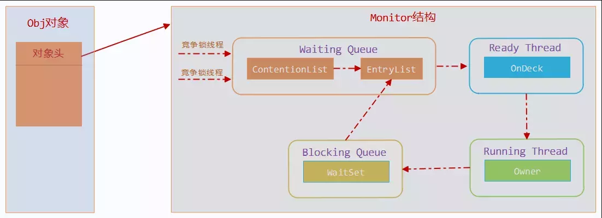

### Sychronized
* 一个monitor对象包括这么几个关键字段：  
    cxq（下图中的ContentionList）、EntryList ，WaitSet，owner。
    
 1、 当一个线程尝试获得锁时：  
    如果该锁已经被占用，则会将该线程封装成一个ObjectWaiter对象插入到cxq的队列尾部，然后暂停当前线程。  
    当持有锁的线程释放锁前，会将cxq中的所有元素移动到EntryList中去，并唤醒EntryList的队首线程  
 2、 如果一个线程在同步块中调用了Object#wait方法，会将该线程对应的ObjectWaiter从EntryList移除并加入到WaitSet中，然后释放锁。当wait的线程被notify之后，会将对应的ObjectWaiter从WaitSet移动到EntryList中。
 
 [测试](../../../marvin-test/src/test/java/thread/TestLockSynchronized.java)
   
### Lock
