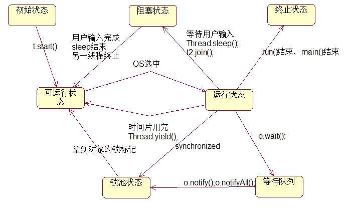

### 线程状态

* start方法
    > start()用来启动一个线程，当调用start方法后，系统才会开启一个新的线程来执行用户定义的子任务，在这个过程中，会为相应的线程分配需要的资源。

* run方法 (start区别,调用run会在当前线程执行，不会另起线程)
    > run()方法是不需要用户来调用的,当通过start方法启动一个线程之后，当线程获得了CPU执行时间，便进入run方法体去执行具体的任务。注意，继承Thread类必须重写run方法，在run方法中定义具体要执行的任务。

* sleep方法
  >  sleep相当于让线程睡眠，交出CPU，让CPU去执行其他的任务。  
　　但是有一点要非常注意，sleep方法不会释放锁，也就是说如果当前线程持有对某个对象的锁，则即使调用sleep方法，其他线程也无法访问这个对象。  
    注意，如果调用了sleep方法，必须捕获InterruptedException异常或者将该异常向上层抛出。当线程睡眠时间满后，不一定会立即得到执行，因为此时可能CPU正在执行其他的任务。所以说调用sleep方法相当于让线程进入阻塞状态。

* yield方法
  > 调用yield方法会让当前线程交出CPU权限，让CPU去执行其他的线程。  
  它跟sleep方法类似，同样不会释放锁。  
  但是yield不能控制具体的交出CPU的时间，另外，yield方法只能让拥有相同优先级的线程有获取CPU执行时间的机会。  
　　注意，调用yield方法并不会让线程进入阻塞状态，而是让线程重回就绪状态，它只需要等待重新获取CPU执行时间，这一点是和sleep方法不一样的。

* join方法
  > 　假如在main线程中，调用thread.join方法，则main方法会等待thread线程执行完毕或者等待一定的时间。  
  如果调用的是无参join方法，则等待thread执行完毕，如果调用的是指定了时间参数的join方法，则等待一定的事件
* interrupt方法
   > 即中断的意思。单独调用interrupt方法可以使得处于阻塞状态的线程抛出一个异常，也就说，它可以用来中断一个正处于阻塞状态的线程；另外，通过interrupt方法和isInterrupted()方法来停止正在运行的线程。